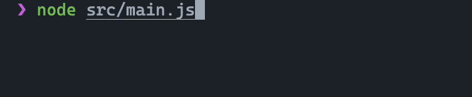

# 🌈

> **ziyan**, a lightweight and beautiful terminal spinner for Node.js.
>
> **紫烟**， 一个适用于Node.js的轻量且漂亮的终端微调器。

<br/>

<br/>
<br/>

## Features

- only esm is supported.

## Install

```shell
pnpm install @mijizhe/ziyan
```

## Useage

```typescript
import { magenta } from "@mijizhe/ansi-escape-sequences/colors"
import { Spinner } from "@mijizhe/ziyan"
import { colordotsBarGenerator } from "@mijizhe/ziyan/colordots"
import { setTimeout as sleep } from "timers/promises"

const spinner = new Spinner(colordotsBarGenerator)

await spinner.start("initializing…")
await sleep(1500)

await spinner.display("it takes a while.", "\n".repeat(5) + magenta(":)"))
await sleep(1500)

await spinner.display("performing the step 1.")
await sleep(1500)

await spinner.succeed("the step 1 done.")

await spinner.start("performing the step 2.")
await sleep(1500)

await spinner.succeed("the step 2 done.")

await spinner.start("performing the step 3.")
await sleep(1500)

await spinner.fail("the step 3 failed!")
```
